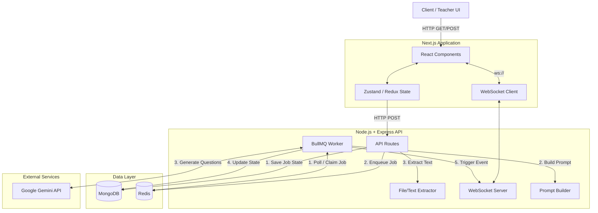
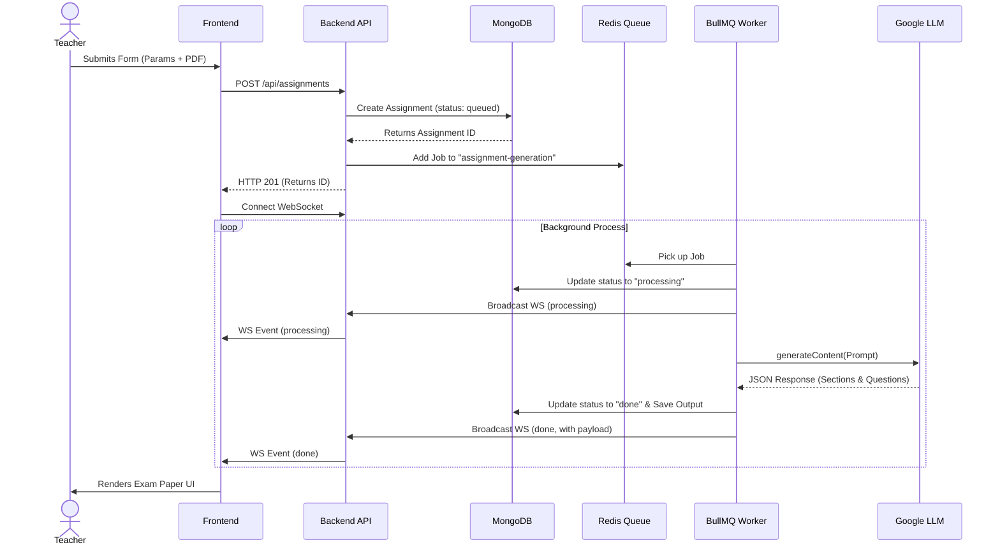

# AI Assessment Creator

A full-stack, AI-powered educational tool designed for teachers to instantly generate structured exam papers tailored to specific subjects, classes, and difficulty levels.

## Overview

This eliminates the manual effort of drafting question papers. Teachers input basic criteria (subject, class, marks, question types) and provide optional reference materials (like PDFs or text notes). The system asynchronously processes this through Google's Gemini LLM, returning a formatted, curriculum-aligned exam paper ready for export.

---

## Features Implemented

*   **Dynamic Assignment Creation:** Granular control over sections, question types, counts, and individual marks.
*   **AI-Powered Generation:** Leverages Google's Gemini 2.5 Flash for high-speed, structured JSON generation of exam content.
*   **Real-time Status Tracking:** WebSockets broadcast job status (queued, processing, done, failed) to the UI in real-time.
*   **Asynchronous Background Processing:** BullMQ and Redis ensure the main thread is never blocked, allowing scalable concurrent document generation.
*   **Rich UI/UX:** Built pixel-perfect to spec using Next.js, featuring a clean, responsive layout, dynamic forms, and an accurate print-ready exam preview.
*   **PDF Export:** Robust server-side PDF generation via Puppeteer with client-side HTML print fallbacks.

---

## Overall Approach

The system uses an event-driven, decoupled architecture. Because LLM generation can take anywhere from 5 to 30 seconds, a standard synchronous HTTP request-response cycle would risk timeouts and provide a poor user experience. 

Instead, the **Frontend** submits a generation request and immediately receives an `assignmentId`. It then establishes a **WebSocket** connection. The **Backend** delegates the heavy lifting to a **BullMQ Worker**, which handles API communication with the LLM, parses the response, and persists it to **MongoDB**. State changes are broadcasted via WebSockets back to the client, triggering UI updates reactively.

---

## Architecture Overview (High-Level Design)



---

## Low-Level Design (LLD)

### Data Models

**Assignment Schema (MongoDB)**
*   `title` (String): e.g., "Midterm Math Exam"
*   `subject` (String)
*   `className` (String)
*   `dueDate` (Date)
*   `status` (Enum): `pending | queued | processing | done | failed`
*   `questionTypes` (Array): `{ type, count, marksEach }`
*   `fileText` (String): Extracted text from uploaded reference materials.
*   `output` (Object): The structured JSON response from Gemini, containing `sections` and `questions`.

### Core Services

1.  **Prompt Builder (`promptBuilder.ts`)**: Dynamically constructs a few-shot prompt for the LLM. It calculates total marks, injects the extracted `fileText` as context, and defines a strict JSON schema for the output, instructing the LLM to balance difficulty levels.
2.  **LLM Service (`llm.ts`)**: Interfaces with `@google/genai`. It requests a `application/json` response type and parses the markdown-free output string directly into TypeScript interfaces.
3.  **File Extractor (`fileExtractor.ts`)**: Uses `pdf-parse` to read raw binary buffers and convert PDF curriculum materials into plaintext for the LLM context window.

---

## Sequence Diagram: Generating a Paper



---

## Folder Structure

```text
├── backend/
│   ├── package.json
│   ├── tsconfig.json
│   └── src/
│       ├── app.ts                 # Express configuration, CORS, Middleware
│       ├── index.ts               # Server bootstrap & DB connection
│       ├── models/
│       │   └── Assignment.ts      # Mongoose Schemas
│       ├── queues/
│       │   ├── queue.ts           # BullMQ initialization
│       │   └── worker.ts          # Background job processing logic
│       ├── routes/
│       │   ├── assignments.ts     # CRUD & Upload endpoints
│       │   └── pdf.ts             # Puppeteer PDF generation
│       ├── services/
│       │   ├── fileExtractor.ts   # PDF/Text parsing
│       │   ├── llm.ts             # Google GenAI wrapper
│       │   └── promptBuilder.ts   # Context formatting
│       └── ws/
│           └── server.ts          # WebSocket broadcast management
│
└── frontend/
    ├── package.json
    ├── next.config.mjs
    ├── app/                       # Next.js App Router Pages
    │   ├── layout.tsx
    │   ├── globals.css
    │   ├── create/                # Assignment Creation Flow
    │   ├── assignments/[id]/      # Exam Paper Preview
    │   └── ...                    # Static pages (Home, Library, Toolkit)
    ├── components/                # React UI Components
    │   ├── Sidebar.tsx
    │   ├── TopBar.tsx
    │   ├── StepOne.tsx            # Form Part 1
    │   ├── StepTwo.tsx            # Form Part 2
    │   └── ExamPaper.tsx          # Rendered Output UI
    ├── lib/
    │   ├── api.ts                 # Fetch wrappers
    │   └── socket.ts              # WebSocket Singleton
    └── store/
        └── formStore.ts           # Zustand global state
```

---

## Environment Variables (`.env`)

To run this project locally, you need to configure environment variables for both the backend and frontend.

### `backend/.env`
```env
# MongoDB Atlas Connection String
MONGODB_URI=mongodb+srv://<user>:<password>@cluster.mongodb.net/vedaai

# Redis Connection String (Upstash or local)
REDIS_URL=redis://default:<password>@your-redis-instance.io:15595

# Google Gemini API Key (from Google AI Studio)
GEMINI_API_KEY=AIzaSy...

# The specific model to use (gemini-2.5-flash recommended for speed/free tier)
GEMINI_MODEL=gemini-2.5-flash

# Allowed origin for CORS
FRONTEND_URL=http://localhost:3000

# Environment
NODE_ENV=development
```

### `frontend/.env.local`
```env
# URL for the Express Backend
NEXT_PUBLIC_API_URL=http://localhost:4000

# WebSocket URL for real-time updates
NEXT_PUBLIC_WS_URL=ws://localhost:4000
```

---

## Setup & Execution

### 1. External Prerequisites
1.  **MongoDB Atlas:** Ensure your current IP address is whitelisted (`Network Access -> Allow Access from Anywhere`).
2.  **Redis:** Get a free serverless Redis instance from [Upstash](https://upstash.com/) or run it locally via Docker.
3.  **Google AI Studio:** Obtain a Gemini API key.

### 2. Backend Setup
```bash
cd backend
npm install
# Ensure backend/.env is populated
npm run dev
```
*The backend will start on `http://localhost:4000`.*

### 3. Frontend Setup
```bash
cd frontend
npm install
# Ensure frontend/.env.local is populated
npm run dev
```
*The frontend will start on `http://localhost:3000`.*

Navigate to `http://localhost:3000` in your browser to start creating assignments.

---

## Live Deployment

The project is deployed and publicly accessible at the following URLs:

| Service  | Platform | URL                                                                 |
|----------|----------|---------------------------------------------------------------------|
| Frontend | Vercel   | [https://assignment-creator-phi.vercel.app](https://assignment-creator-phi.vercel.app) |
| Backend  | Render   | [https://assignment-creator-s96e.onrender.com](https://assignment-creator-s96e.onrender.com) |

### Production Environment Variables

**Backend (set in Render Dashboard → Environment)**
| Variable | Description |
|---|---|
| `MONGODB_URI` | MongoDB Atlas connection string |
| `REDIS_URL` | Redis connection string (Upstash) |
| `GEMINI_API_KEY` | Google AI Studio API key |
| `GEMINI_MODEL` | `gemini-2.5-flash` |
| `FRONTEND_URL` | `https://assignment-creator-phi.vercel.app` (for CORS) |
| `NODE_OPTIONS` | `--max-old-space-size=460` (prevents OOM on free tier) |

**Frontend (set in Vercel Dashboard → Settings → Environment Variables)**
| Variable | Description |
|---|---|
| `NEXT_PUBLIC_API_URL` | `https://assignment-creator-s96e.onrender.com` |
| `NEXT_PUBLIC_WS_URL` | `wss://assignment-creator-s96e.onrender.com` |
